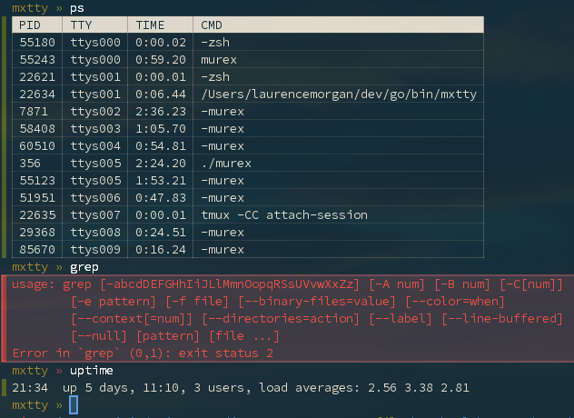
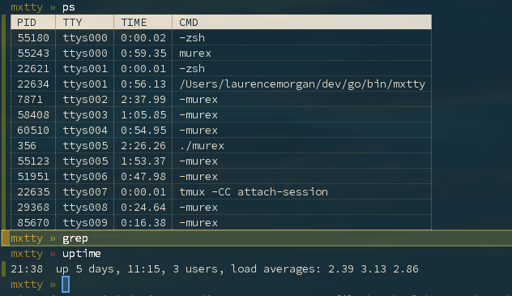
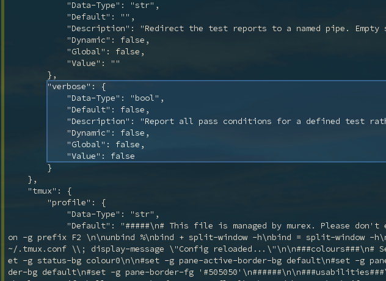
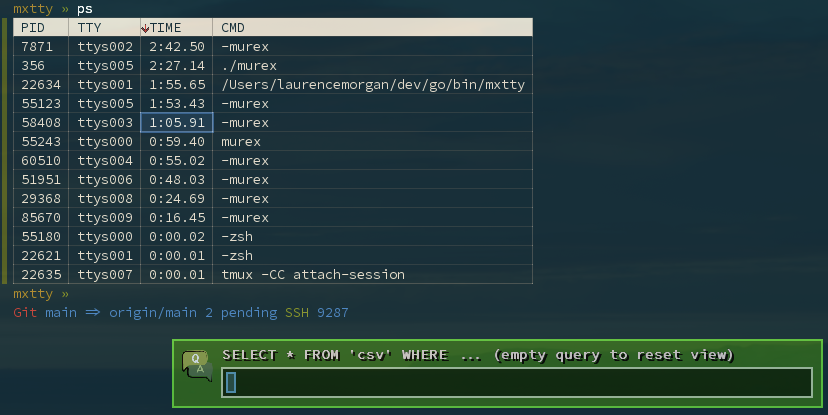
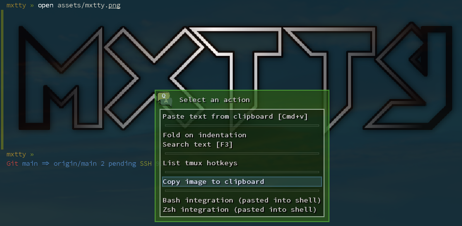
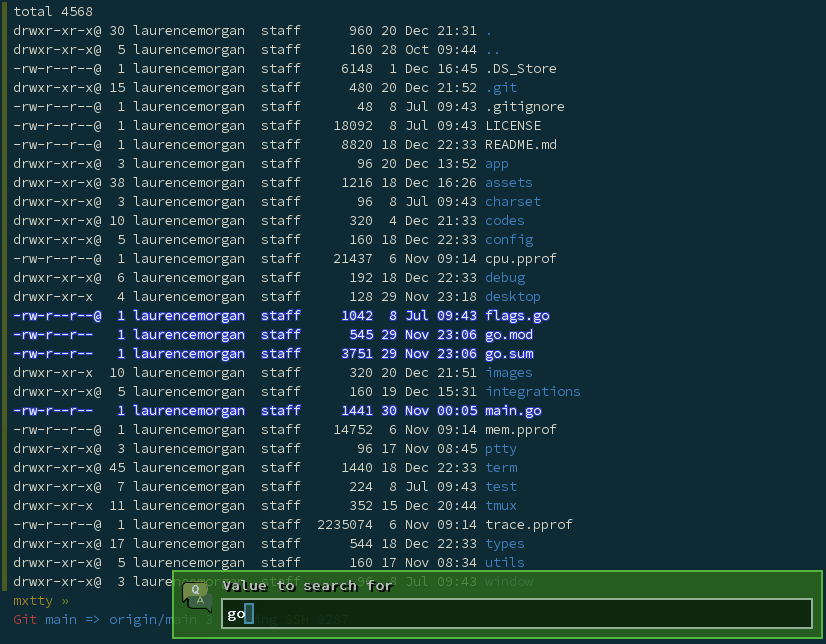

<h1>Ttyphoon</h1>

(previously called mxtty)

- [Multimedia Terminal Emulator](#multimedia-terminal-emulator)
- [Screenshots](#screenshots)
  - [Output Blocks](#output-blocks)
  - [Structured Text](#structured-text)
  - [Tables](#tables)
  - [Images](#images)
  - [Tmux Support](#tmux-support)
  - [Highlighted Search Results](#highlighted-search-results)
  - [Plus more](#plus-more)
- [How It Works](#how-it-works)
- [Whats Left To Do](#whats-left-to-do)
  - [Escape Codes](#escape-codes)
    - [VT100](#vt100)
    - [VT52 mode](#vt52-mode)
    - [VT200 mode](#vt200-mode)
    - [Tektronix 4014 mode](#tektronix-4014-mode)
    - [Window management codes](#window-management-codes)
    - [Extended features](#extended-features)
    - [Common application support](#common-application-support)
  - [Application Usability](#application-usability)
  - [Tmux Integration](#tmux-integration)
- [Supported Platforms](#supported-platforms)
- [Install Guide](#install-guide)
- [How To Support](#how-to-support)

## Multimedia Terminal Emulator

The aim of this project is to provide an easy to use terminal emulator that
supports inlining multimedia widgets using native code as opposed to web
technologies like Electron.

Currently the project is _very_ alpha.

The idea behind this terminal emulator is that is can be used by any $SHELL,
however hooks will be built into [Murex](https://github.com/lmorg/murex) so
the terminal will be instantly usable even before wider support across other
shells and command line applications is adopted.

At its heart, `Ttyphoon` is a regular terminal emulator. Like Kitty, iTerm2, and
PuTTY (to name a few). But where `Ttyphoon` differs is that it also supports
inlining rich content. Some terminal emulators support inlining images. Others
might also allow videos. But none bar some edge case Electron terminals offer
collapsible trees for JSON printouts. Easy to navigate directory views. Nor any
other interactive elements that we have come to expect on modern user
interfaces.

The few terminal emulators that do attempt to offer this usually fail to be
good, or even just compatible, with all the CLI tools that we've come to depend
on.

`Ttyphoon` aims to do _both well_. Even if you never want for any interactive
widgets, `Ttyphoon` will be a good terminal emulator. And for those who want a
little more GUI in their CLI, `Ttyphoon` will be a great modern user interface.

## Screenshots

### Output Blocks

Command output is grouped into blocks to make it easier to visually see the
separation between different command output.

Those blocks are coloured too, to help identify whether a command succeeded or
failed.

Those blocks can be highlighted by hovering over them

And even collapsed, hidden from view

### Structured Text

IDE-like tools for working with structured text, like JSON. Hover over a branch
to highlight its child nodes

Click to collapse that block of text

### Tables

Output can be presented as tables. Which can be sorted and even filtered using
SQL. All without having to rerun the commands that generated that output

### Images

Support for inlined images, where images are treated as images. for example
they can be copied to clipboard

### Tmux Support

Tmux support built in using tmux's control plane. This allows for the power of
tmux but with the easy of use and elegance of being fully integrated into the
terminal emulator

(in this screenshot, tmux's prefix key was rebinded to `F2` in `~/.tmux.conf`)

### Highlighted Search Results

Search terms can be highlighted to quickly find instances of that term

### Plus more

Ttyphoon has only been in development for a little over a year and features a
purpose built, hardware accelerated, rendering engine to facilitate this hybrid
of text and media. So expect many more feature to come!

## How It Works

Ttyphoon uses SDL ([Simple DirectMedia Layer](https://en.wikipedia.org/wiki/Simple_DirectMedia_Layer))
which is a simple hardware-assisted multimedia library. This enables the
terminal emulator to be both performant and also cross-platform. Essentially
providing some of the conveniences that people have come to love from tools
like Electron while still offering the benefits of native code.

The multimedia and interactive components will be passed from the controlling
terminal applications via ANSI escape sequences. Before groan, yes I agree that
in-band escape sequences are a lousy way of encoding meta-information. However
to succeed at being a good terminal emulator, it needs to support some historic
design decisions no matter how archaic they might seem today. This allows
Ttyphoon to work with existing terminal applications _and_ for third parties to
easily add support for their applications to render rich content in Ttyphoon
without breaking compatibility for legacy terminal emulators.

## Whats Left To Do

In short, _a lot_!! Some of what has been detailed above is still aspirational.
Some of it has already been delivered but in a _very_ alpha state. And while
there is lots of error handling and unit tests, test coverage is still pretty
low and exceptions will crash the terminal (quite deliberately, because I want
to see where the application fails).

Below is a high level TODO list of features and compatibility. If an item is
ticked but not working as expected, then please raise an issue in Github.

### Escape Codes

#### VT100

- C1 codes
  - [x] common: can run most CLI applications
  - [x] broad: can run older or more CLI applications
  - [ ] complete: xterm compatible
- CSI codes
  - [x] common: can run most CLI applications
  - [x] broad: can run older or more complicated CLI applications
  - [ ] complete: xterm compatible
- SGR codes
  - [x] common: can run most CLI applications
  - [x] broad: can run older or more complicated CLI applications
  - [ ] complete: xterm compatible
  - [ ] extended underline: kitty compatible
- OSC codes
  - [x] common: can run most CLI applications
  - [x] broad: can run older or more complicated CLI applications
  - [ ] complete: xterm compatible
- DCS codes
  - [ ] common: can run most CLI applications
  - [ ] broad: can run older or more complicated CLI applications
  - [ ] complete: xterm compatible
- [x] Alt character sets
- [x] Wide characters
  - [ ] vt100 (ASCII characters)
  - [x] Unicode (eg logograph-centric languages and emoticons)
- Keyboard
  - [x] Ctrl modifiers
  - [x] Alt modifiers
  - [x] Shift modifiers
  - [x] special keys (eg function keys, number pad, etc)
    - [ ] glitch free (some bugs still exist)
  - [x] tmux support for modifiers
- Mouse tracking
  - [ ] common: can run most CLI applications
  - [ ] broad: can run older or more complicated CLI applications
  - [ ] complete: xterm compatible

#### VT52 mode

- [ ] cursor movements
- [ ] special modes

#### VT200 mode

Some compatibility already exists. Detailed breakdown coming...

#### Tektronix 4014 mode

- [ ] graphics plotting
- [ ] text rendering
  
#### Window management codes

eg `xterm` and similar terminal emulators

- [x] titlebar can be changed
- [ ] ~~window can be moved and resized (WILL NOT IMPLEMENT)~~
- [ ] window can be minimized and restored

#### Extended features

- [ ] Hyperlink support
- [ ] Bracketed paste mode
- Inlining images
  - [x] Ttyphoon codes
  - [ ] iterm2 compatible
  - [ ] Kitty compatible
  - [x] sixel graphics
  - [ ] ReGIS graphics
- Code folding
  - [x] alpha: available but expect changes to the API
  - [x] stable: available to use in Murex
- Table sorting
  - [x] alpha: available but expect changes to the API
  - [x] stable: available to use in Murex

#### Common application support

- [x] Supports `tmux`
  - [x] usable from CLI
  - [x] glitch-free from CLI
  - [x] tmux control mode supported
- [x] Supports `vim`
  - [x] usable
  - [x] glitch-free
- [x] Supports `murex`
  - [x] usable
  - [x] glitch-free

### Application Usability

- [x] Terminal can be resized
- [x] Scrollback history
  - [x] usability hints added
- [x] discoverability hints added
- [x] Typeface can be changed
- [x] Colour scheme can be changed
  - [x] supports iTerm2 colour themes
- [ ] Bell can be changed
- [x] Default term size can be changed
- [x] Default command / shell can be changed

## Supported Platforms

Support for the following platforms is planned:

- [x] Linux
  - [x] tested on Arch
  - [ ] tested on Ubuntu
  - [ ] tested on Rocky
- [ ] BSD
  - [ ] tested on FreeBSD
  - [ ] tested on NetBSD
  - [ ] tested on OpenBSD
  - [ ] tested on DragonflyBSD
- [x] macOS
  - [ ] tested on 12.x, Monterey
  - [ ] tested on 13.x, Ventura
  - [x] tested on 14.x, Sonoma
  - [x] tested on 15.x, Sequoia
- [ ] Windows
  - [ ] PTY support implemented
  - [ ] tested on Windows 10
  - [ ] tested on Windows 11

## Install Guide

Currently Ttyphoon can only be compiled from source.

To do so you will need the following installed:
- C compiler (eg GNU C)
- Go compiler
- SDL libraries
  - sdl2
  - sdl2_ttf
  - sdl2_mixer
- `pkg-config`

Aside from that, it's as easy as running `go build .` from the git repository
root directory.

## How To Support

Regardless of your time and skill set, there are multiple ways you can support
this project:

- **Contributing code**: This could be bug fixes, new features, or even just
  correcting any typos.

- **Testing**: There is a plethora of different software that needs to run
  inside a terminal emulator and a multitude of distinct platforms that this
  could run on. Any support testing Ttyphoon would be greatly appreciated.

- **Documentation**: This is possibly the hardest part of any project to get
  right. Eventually documentation for this will follow the same structure as
  [Murex Rocks](https://murex.rocks) (albeit its own website) however, for now,
  any documentation written in markdown is better than none.

- **Architecture discussions**: I'm always open to discussing code theory. And
  if it results in building a better terminal emulator, then that is a
  worthwhile discussion to have.

- **Porting escape codes to other applications**: Currently [Murex](https://github.com/lmorg/murex)
  is the pioneer for supporting Ttyphoon-specific ANSI escape codes. However it
  would be good to see some of these extensions expanded out further. Maybe
  even to a point where this terminal emulator isn't required any more than a
  place to beta test future proposed escape sequences.

